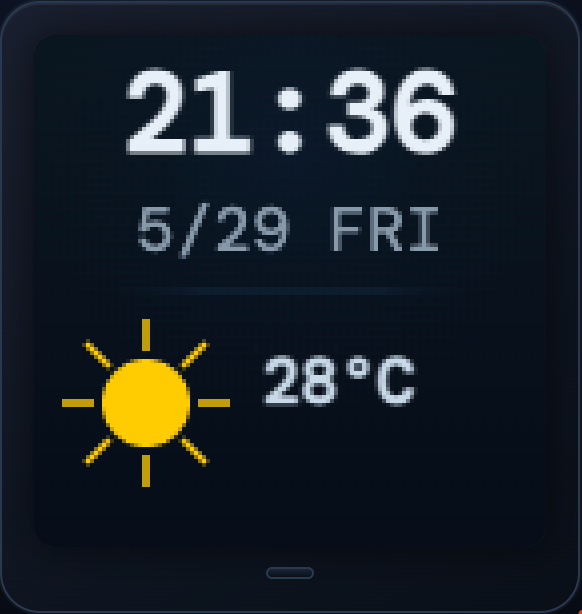
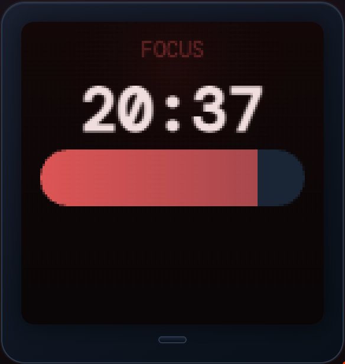
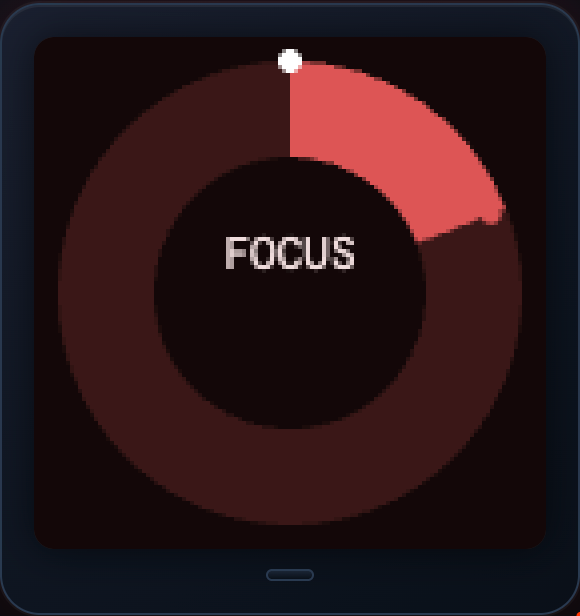
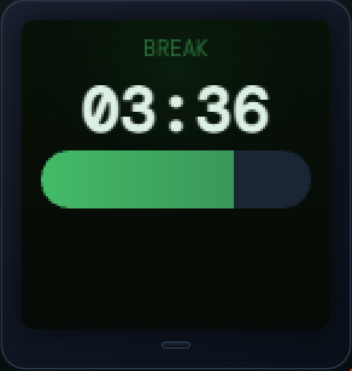
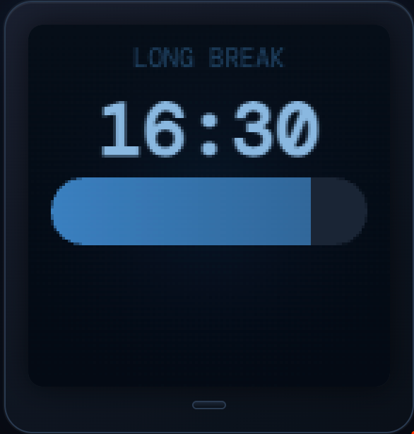
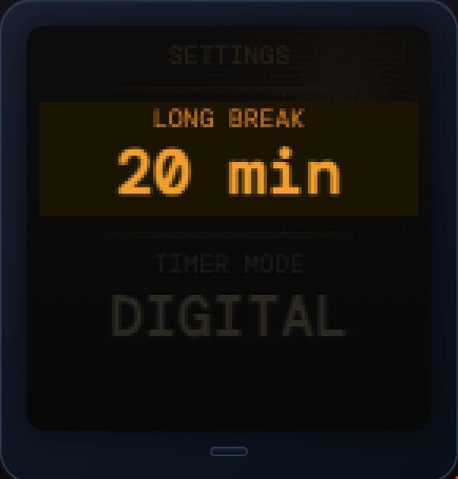

# PomoCoro 🍅

**ATOMS3で作る、傾けて操作するポモドーロタイマー**

ATOMS3を傾けるだけで画面が切り替わるポモドーロタイマーです。
ボタン操作なし、メニューなし。コロコロ転がすだけで即集中モードに入れます。

[](https://inogit.github.io/PomoCoro/)

---


## 📺 デモ

> ▶️ [シミュレーターを開く](https://inogit.github.io/PomoCoro/)
> ブラウザ上でATOMS3の全画面表示をインタラクティブに確認できます。

---

## 📱 画面一覧

### ホーム画面


時刻・日付・天気をリアルタイム表示します。
Wi-Fi接続時はOpen-MeteoのAPIから気象データを自動取得します。

---

### タイマー画面（集中中）
| デジタル表示 | サークル表示 |
|------------|------------|
|  |  |

25分の集中タイマーです。2つの表示モードを設定で切り替えられます。
タイマーが終わると画面がフラッシュして通知します。

---

### タイマー画面（休憩中）


集中25分が終わると自動で5分の休憩タイマーに切り替わります。
以降25分→5分を繰り返します。

---

### 休憩画面（長い休憩）


さらに右に傾けると長い休憩タイマーです。
設定で15分または20分を選択できます。

---

### 記録画面


今日の集中セッション数と累計集中時間を表示します。
日付が変わると自動でリセットされます。

---

### 設定画面


水平に置くと設定モードになります。
- **長い休憩の時間**: 15分 / 20分
- **タイマー表示モード**: DIGITAL / CIRCLE

---

## 🕹️ 操作方法

| 操作 | 動作 |
|------|------|
| 垂直に立てる（正面） | ホーム画面 |
| 右に90°倒す | タイマー開始（25分） |
| さらに右に倒す | 長い休憩タイマー |
| さらに右に倒す | 今日の記録 |
| 左に倒す | 逆順に戻る |
| 水平に置く | 設定画面 |
| 画面をタップ | 各画面の機能（下記） |

### タップ操作

| 画面 | タップの動作 |
|------|------------|
| ホーム | 天気を今すぐ更新 |
| 集中中 | タイマーをリスタート |
| 休憩中 | 休憩を早切りして集中へ |
| 記録 | 今日の記録をクリア |
| 設定 | 値を変更（短押し） / 項目移動（長押し） |

---

## 🛒 必要なパーツ

| パーツ | 購入先 |
|-------|-------|
| M5Stack ATOMS3 | [スイッチサイエンス](https://www.switch-science.com/products/8670) |
| ATOM TailBAT | [スイッチサイエンス](https://www.switch-science.com/products/6348) |
| USB-Cケーブル（書き込み・充電用） | 手持ちのものでOK |

---

## 🛠️ 開発環境のセットアップ

### 1. Arduino IDE 2 のインストール

[arduino.cc/en/software](https://www.arduino.cc/en/software) からダウンロードしてインストール。

### 2. ボードマネージャーにURLを追加

`ファイル → 基本設定 → 追加のボードマネージャのURL` に以下を入力：

```
https://m5stack.oss-cn-shenzhen.aliyuncs.com/resource/arduino/package_m5stack_index.json
```

### 3. M5Stack ボードパッケージをインストール

`ツール → ボード → ボードマネージャ` で **M5Stack** を検索してインストール。  
インストール後、`ツール → ボード → M5Stack → M5AtomS3` を選択。

### 4. ライブラリをインストール

`ツール → ライブラリを管理` で以下の2つをインストール：

| ライブラリ | 作者 |
|-----------|------|
| M5Unified | M5Stack |
| ArduinoJson | Benoit Blanchon |

### 5. USB-CDC On Boot を有効化

`ツール → USB-CDC On Boot → Enabled` に設定。

---

## ⚙️ スケッチの設定

`PomoCoro/PomoCoro.ino` の冒頭にあるユーザー設定エリアを編集してください。

```cpp
// --- WiFi設定 ---
const char* WIFI_SSID_1 = "自宅のSSID";
const char* WIFI_PASS_1 = "自宅のパスワード";

const char* WIFI_SSID_2 = "外出用のSSID（ポケットWi-Fiなど）";
const char* WIFI_PASS_2 = "パスワード";

// --- 位置情報（天気取得用）---
// Googleマップで場所を右クリックすると確認できます
const float LOC_LAT = 35.46f;  // 例: 横浜
const float LOC_LON = 139.62f;
```

---

## 📝 書き込み手順

### 1. IMUキャリブレーション（初回のみ）

`calibration/calibration.ino` を先に書き込んでください。

1. シリアルモニタを開く（115200bps）
2. ATOMS3を各方向に傾けながら `ax / ay / az` の符号を確認
3. 確認した値を `PomoCoro.ino` 冒頭の2行に反映

```cpp
static const int UPRIGHT_AXIS_SIGN = +1;  // 垂直時にayが正なら+1、負なら-1
static const int RIGHT_AXIS_SIGN   = -1;  // 右に倒した時にaxが正なら+1、負なら-1
```

### 2. メインスケッチの書き込み

1. ATOMS3のリセットボタンを**約2秒長押し** → 緑LEDが点灯したら離す（ダウンロードモード）
2. `ツール → ポート` で表示されたポートを選択
3. アップロードボタン（→）をクリック

---

## 📌 作り方のコツ

- **必ず `calibration.ino` を先に実行**してください。IMUの軸方向は個体差があるため、符号が合っていないと傾き操作が正しく動作しません。
- **書き込みのたびにダウンロードモードへの切り替えが必要**です。リセットボタン長押しを忘れずに。
- **`USB-CDC On Boot → Enabled` を忘れると画面に何も表示されません。** 変更後は再書き込みが必要です。
- **ATOMS3は机に垂直に立てて使います。** 水平に置くと設定モードになります。
- **ATOM TailBATは約2〜3時間動作します。** 毎日の仕事終わりにUSB-Cで充電しておくと翌日も快適に使えます。
- Wi-Fiに繋がらない環境でも**ポモドーロタイマーは正常に動作します**（時刻・天気は表示されません）。

---

## 📂 ファイル構成

```
PomoCoro/
├── index.html              # 画面シミュレーター（ブラウザで動作）
├── README.md               # このファイル
├── PomoCoro/
│   └── PomoCoro.ino        # メインスケッチ
├── calibration/
│   └── calibration.ino     # IMUキャリブレーション用スケッチ
├── images/                 # スクリーンショット
└── docs/
    └── SCREEN_DESIGN.md    # 画面設計書（英語）
```

---

## 📄 ライセンス

MIT License

---

## 🙏 使用しているサービス・ライブラリ

| 名称 | 用途 |
|------|------|
| [M5Unified](https://github.com/m5stack/M5Unified) | ATOMS3制御 |
| [ArduinoJson](https://arduinojson.org/) | JSON解析 |
| [Open-Meteo](https://open-meteo.com/) | 天気データ取得（無料・APIキー不要） |
| [NTP: ntp.nict.jp](https://jjy.nict.go.jp/ntp/) | 時刻同期 |

